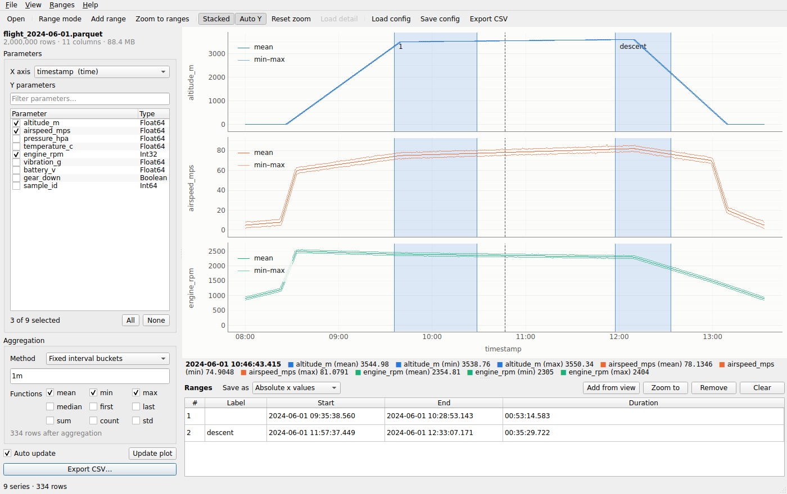

# Parquetry

Explore, compact and export large Parquet and CSV files. Parquetry is a desktop
app for browsing time series (or any tabular) data stored in Parquet or CSV, plus
a command line tool that replays what you set up in the app on any number of
similar files.



- **File browser on start-up** with a metadata preview (rows, columns, row groups,
  schema) that reads only the Parquet footer, or only the start of a CSV file.
- **Parquet and CSV input.** The separator (comma, semicolon, tab, pipe), decimal
  comma and column types of CSV files are detected automatically, dates and times
  included.
- **Pick an x axis and any number of y parameters.** Timestamps, numbers, text or
  the row number work as x; numeric, boolean and text columns can be plotted.
- **Text data** is drawn as steps on an axis labelled with its values (states,
  modes, flight phases). A text x axis shows one bar or column of markers per
  category, in the order the categories appear in the file.
- **Data table** below the plot with the rows behind the visible part of the plot,
  text included. Zoom the plot to move through the rows.
- **Built for large files.** Only the selected columns are read, range filters
  are pushed down into the Parquet scan, and plots of more than a million rows
  are drawn as a min/max envelope, so spikes stay visible. You can load full
  detail for the part you have zoomed into.
- **Aggregation to compact data:** every Nth row, fixed interval buckets (`500ms`,
  `1m`, `1h`, …), a target number of buckets or one bucket per x value (per
  category), with mean, min, max, median, first, last, sum, count and std.
- **Interactive plot:** stacked or overlaid, optional point markers, crosshair
  readout, scroll to zoom, and drag to select time ranges.
- **CSV export:** separator, time format (ISO, custom strftime, epoch, elapsed
  seconds), precision, decimal comma, missing values, quoting, line endings,
  BOM, column renames, one file per range, all with a live preview.
- **Reusable processing configs:** save the settings as JSON and apply them to
  other files from the UI (batch export) or from scripts with
  `parquetry export`. Ranges can be stored relative to each file's start.

## Installation

### Standalone downloads

Each [GitHub release](https://github.com/loganrf/parquetry/releases) includes
self-contained builds that do not need Python:

| Platform | File | Contents |
|---|---|---|
| Windows (x86-64) | `parquetry-<version>-windows-x86_64.zip` | Unzip and run `parquetry-gui.exe` (UI) or `parquetry.exe` (CLI) |
| macOS (Apple Silicon) | `parquetry-<version>-macos-arm64.dmg` | Drag *Parquetry* into *Applications* |
| macOS (Intel) | `parquetry-<version>-macos-x86_64.dmg` | Same as above |
| Ubuntu / Debian (x86-64) | `parquetry_<version>_amd64.deb` | `sudo apt install ./parquetry_<version>_amd64.deb`, then `parquetry` / `parquetry-gui` |
| Linux (x86-64) | `parquetry-<version>-linux-x86_64.tar.gz` | Extract and run `parquetry/parquetry-gui` |

`SHA256SUMS.txt` lists checksums for all files.

- **macOS:** the app is signed and notarized by Apple, so it opens normally.
  v0.1.0 was not signed: for it, right-click the app and choose *Open* the first
  time, or run `xattr -dr com.apple.quarantine /Applications/Parquetry.app` if
  macOS says the app is damaged.
  The command line tool is at `/Applications/Parquetry.app/Contents/MacOS/parquetry`;
  you can add it to your `PATH` with a symlink.
- **Windows:** the build is not code-signed, so SmartScreen may warn about an
  unknown publisher. Choose *More info → Run anyway*.
- **Linux (tar.gz):** Qt needs the usual desktop libraries (`libegl1`,
  `libxkbcommon-x11-0`, `libxcb-cursor0`, …). The `.deb` installs them as
  dependencies.

### With pip

Python 3.10 or newer is required.

```bash
pip install "parquetry[ui] @ git+https://github.com/loganrf/parquetry"   # app + CLI
pip install "parquetry @ git+https://github.com/loganrf/parquetry"       # CLI only, no Qt (servers, CI)
```

Optional extras: `metadata` (pyarrow, which adds row groups, compression and
writer details to `info` and the file browser) and `all`.

From a checkout: `pip install -e ".[ui,test]"`.

## Quick start

```bash
parquetry sample flight.parquet --rows 2000000   # synthetic telemetry to play with
parquetry sample flight.csv --rows 100000        # the same as CSV
parquetry                                        # open the app with the file browser
parquetry flight.parquet                         # or open a file directly
```

## Using the app

1. **Choose a file.** The start page is a file browser that shows Parquet and
   CSV files (tick *Show all files* to see everything; other text files open as
   CSV). Selecting a file shows its format, size, row count and schema;
   double-click or press *Open* to explore it. You can also drop a file onto the
   window or use *File → Open recent*.
2. **Choose parameters.** Pick the **X axis** (a timestamp column is chosen
   automatically) and tick the **Y parameters**. The filter box helps when a file
   has hundreds of columns. Double-click a parameter to show only that one.
   Text parameters get a plot of their own, also when the others are overlaid.
3. **Aggregate** (optional). Choose a method and the functions to apply. If you
   choose both *min* and *max*, they are drawn as a shaded band. The plot and
   exports both use this aggregation. With a text x axis, *One bucket per x
   value* aggregates per category, for example the mean revenue per region.
4. **Explore the plot.** Scroll to zoom and drag to pan. *Auto Y* fits the y axis
   to the visible data, *Stacked* switches between one plot per parameter and a
   single overlay, and *Points* marks every data point, so values surrounded by
   gaps (nulls), which no line can connect, stay visible. The readout under the
   plot shows the values under the cursor. When the plot shows a min/max
   envelope of a large file, zoom in and press **D** to load full detail for
   that region. The **Data** tab under the plot lists the rows behind the
   visible part of the plot (the first 50,000) and follows the plot as you zoom
   and pan. Ctrl+C copies the selected cells.
5. **Select ranges.** **Shift+drag** on the plot, or turn on **Range mode (R)**
   and drag, or press **Add range (A)**. Ranges can be moved and resized on the
   plot, edited or labelled in the table below it, and removed from the table or
   with a right-click. *Save as* chooses whether a saved configuration stores
   them as absolute times or as offsets from the start of the data. Offsets can
   be applied to other recordings. Ranges need a numeric or time x axis.
6. **Export CSV (Ctrl+E).** Choose the output file, all data or only the
   selected ranges (optionally one file per range), whether to use the
   aggregation, column headers and the CSV format. The preview updates as you
   change settings.
7. **Save the configuration (Ctrl+S)** to reuse it. *Copy CLI command* in the
   export dialog copies an equivalent `parquetry export` command.
   **File → Batch export (Ctrl+B)** applies the current settings, or a saved
   configuration, to a list of files or folders. **File → Load config (Ctrl+L)**
   applies a saved configuration to the open file.

| Shortcut | Action |
|---|---|
| Ctrl+O | Back to the file browser |
| R / Shift+drag | Range selection |
| A | Add a range in the middle of the view |
| Z | Zoom to the selected ranges |
| S | Toggle stacked / overlay |
| P | Toggle point markers |
| Y | Toggle automatic y scaling |
| D | Load full detail for the visible area |
| Ctrl+0 | Reset zoom |
| Ctrl+E / Ctrl+S / Ctrl+L / Ctrl+B | Export, save config, load config, batch export |

## Command line

```text
parquetry [ui] [FILE] [--config CFG]   open the app (the default command)
parquetry info FILE [--stats] [--json] format, schema, row count, x range, optional column statistics
parquetry export INPUT... [options]    filter, aggregate and write CSV
parquetry sample PATH [--rows N]       write synthetic telemetry data
```

`parquetry export` takes Parquet and CSV files, directories (`-r` to recurse) and
glob patterns. Directories are searched for `.parquet`, `.parq`, `.pq`, `.csv` and
`.tsv` files, leaving out files that the export itself writes, so repeating an
export in a folder of CSV files does not export its earlier results. Options on
the command line override values from `--config`:

```bash
# Re-run a configuration saved in the app on a whole folder
parquetry export data/*.parquet --config telemetry.json -o out/{stem}.csv

# Everything on the command line: one-minute means and maxima of two columns
parquetry export flight.parquet --x timestamp --y altitude_m airspeed_mps \
    --agg interval --every 1m --func mean max -o flight_1min.csv

# The first ten minutes of every file, one file per range, semicolon separated
parquetry export runs/ --config cfg.json --range 0 10m warmup --range-mode relative \
    --split-ranges --sep ';' --decimal-comma

# Check what would be written, then save the options as a configuration
parquetry export flight.parquet --y altitude_m --n 100 --dry-run --save-config every100.json

# CSV input with a text x axis: mean and maximum revenue per region
parquetry export sales.csv --x region --y revenue --agg per_value --func mean max -o -
```

| Group | Options |
|---|---|
| Data | `--x COL`, `--y COL...`, `--range START END [LABEL]` (repeatable, `-` for an open end), `--range-mode absolute\|relative`, `--all-data`, `--split-ranges`, `--no-sort` |
| Aggregation | `--agg none\|every_nth\|interval\|target_points\|per_value`, `--n N`, `--every 10s\|1m\|<number>`, `--points N`, `--func mean min max median first last sum count std` |
| CSV | `--sep`, `--time-format iso\|custom\|epoch_s\|epoch_ms\|elapsed_s`, `--datetime-format`, `--float-precision`, `--decimal-comma`, `--null-value`, `--quote-style`, `--no-header`, `--bom`, `--crlf`, `--rename OLD=NEW` |
| Run | `-o PATH\|DIR\|-`, `-r`, `--save-config PATH`, `--dry-run`, `--skip-existing`, `--fail-fast`, `-q` |

Output paths may use the placeholders `{stem}`, `{name}`, `{parent}` (folder
name), `{dir}` (folder path) and `{range}` (the range label or number). A relative path from a configuration file is
resolved next to each input file. A path given with `-o` is resolved against the
current directory. The exit code is `0` on success, `1` if any file failed and
`2` for invalid options, so the command fits into scripts and schedulers.

## Configuration files

Configurations are plain JSON. Every section except `x` and `y` is optional:

```json
{
  "version": 1,
  "x": "timestamp",
  "y": ["altitude_m", "airspeed_mps"],
  "range_mode": "relative",
  "ranges": [
    {"start": 0, "end": 600, "label": "takeoff"},
    {"start": "1h", "end": null}
  ],
  "aggregation": {"method": "interval", "every": "1s", "functions": ["mean", "max"]},
  "sort": true,
  "csv": {
    "separator": ",",
    "include_header": true,
    "float_precision": 3,
    "decimal_comma": false,
    "time_format": "iso",
    "datetime_format": "%Y-%m-%d %H:%M:%S%.3f",
    "null_value": "",
    "quote_style": "necessary",
    "line_terminator": "lf",
    "include_bom": false,
    "rename": {"altitude_m_mean": "Altitude [m]"}
  },
  "output": {"path": "{stem}_export.csv", "split_ranges": false}
}
```

- **Ranges:** absolute ranges use ISO 8601 times (or numbers for a numeric x).
  Relative ranges are offsets from the first x value. For time columns they are
  seconds or durations like `"90s"` or `"1h30m"`. `null` leaves an end open.
- **Aggregation methods:** `none`, `every_nth` (`n`), `interval` (`every`: a
  duration for time axes or a bucket width for numeric axes; buckets are aligned
  to calendar/epoch boundaries), `target_points` (`points` equal-width
  buckets) and `per_value` (one bucket per distinct x value, the only bucketed
  method for a text x axis). With several functions, columns are named
  `<column>_<function>`.
- **Text parameters** support `first`, `last`, `count`, `min` and `max`; other
  functions are left out for them, and if none of the configured functions
  applies, the first value of each bucket is written.
- **`rename`** maps output column names (after aggregation) to CSV headers.
- Unknown keys are rejected, so typos surface immediately.

## CSV files and text data

- **Detection.** The separator is guessed from the first lines (`.tsv` files are
  always tab separated), and a decimal comma is assumed when numbers use one and a
  separator other than a comma. The first line holds the column names. A UTF-8
  byte order mark is ignored and invalid UTF-8 is replaced, so files from other
  encodings still open.
- **Column types** are inferred from the first 10,000 rows: integers, floats,
  booleans (`true`/`false`), ISO 8601 dates and times (with time zone offsets) and
  text. Empty cells and `NA`, `N/A`, `#N/A`, `null` and `NULL` are missing values.
  When a file is opened, the whole file is then checked: a column whose later
  values do not fit becomes a float column (`1`, `2`, … `2.5`) or a text column.
- **Text** can be a y parameter and the x axis. Text values are plotted at the
  positions of their sorted categories. A text x axis keeps the categories, and
  the rows, in the order they appear in the file (rows are not sorted by a text x
  column), and ranges are not available for it. Categorical Parquet columns are
  treated as text.
- **Exports** of a CSV file work exactly as for Parquet, and CSV files that
  Parquetry writes with ISO 8601 times (the default) read back with the same
  column types.

## How large files are handled

Parquetry uses [polars](https://pola.rs) lazy queries, so only the columns you
select are read. Range filters use Parquet statistics to skip row groups, and
aggregation happens in the query engine. CSV output is streamed to disk and
written to a temporary file, which is renamed only when the export succeeds.
The plot never holds more than about a million points per series (100,000 with
a text x axis). Larger results are reduced to a min/max envelope for display
only, and exports always use the full data.

CSV files have no column statistics and must be parsed for every query, so they
are slower to work with than Parquet: on a 4-core machine, opening a 220 MB CSV
file with 3 million rows (which checks every value) takes about 2 s.

On a 20 million row, 876 MB file (4-core machine), reading the metadata takes
0.07 s, the first plot about 2 s, one-second aggregation 0.6 s, and exporting a 5 minute window
of raw data 0.12 s.

## Development

```bash
pip install -e ".[ui,metadata,test]"
QT_QPA_PLATFORM=offscreen pytest      # the UI tests run headless
```

The code is split into a UI-independent core (`dataset.py` reads Parquet and
CSV files, `config.py`, `processing.py`, `cli.py`) and the Qt app in
`parquetry/ui/`. The app and the
CLI call the same functions, so a saved configuration produces the same output
in both.

### Building releases

CI (`.github/workflows/ci.yml`) runs the tests on Linux, Windows and macOS and
builds and smoke-tests a Linux bundle. To publish a release:

1. Update `__version__` in `src/parquetry/__init__.py`.
2. Tag and push: `git tag v0.2.0 && git push origin v0.2.0`.

`.github/workflows/release.yml` checks that the tag matches the version. It then
builds the wheel and sdist, uses PyInstaller to build the Windows, macOS
(arm64 and x86-64) and Linux bundles, runs `packaging/smoke_test.py` against
each bundle (the CLI end to end, the UI headless and, on macOS, the app's
`Info.plist`), packages them with `packaging/package.py`, and publishes
everything with checksums as a GitHub release. Tags with a hyphen (`v0.2.0-rc1`) become pre-releases. Starting the
workflow manually builds all artifacts without publishing.

The macOS app and disk images are signed with a Developer ID certificate and
notarized by Apple. This needs a one-time setup with an Apple Developer account
and five repository secrets, described in
[docs/macos-notarization.md](docs/macos-notarization.md). Tagged releases fail
until the secrets are set.

To build a bundle locally on the current platform:

```bash
pip install -e ".[package]"
pyinstaller packaging/parquetry.spec --noconfirm
python packaging/smoke_test.py dist
python packaging/package.py dist artifacts
```

## License

MIT
